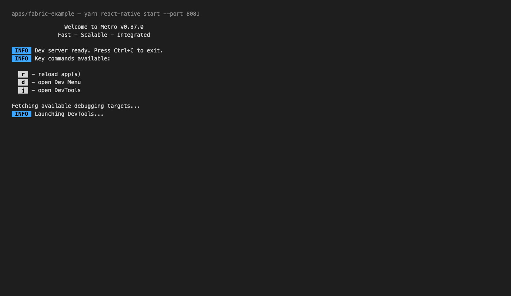
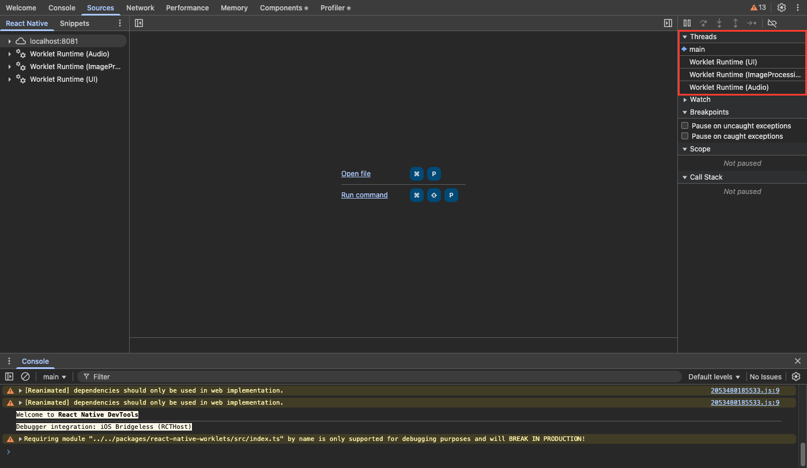
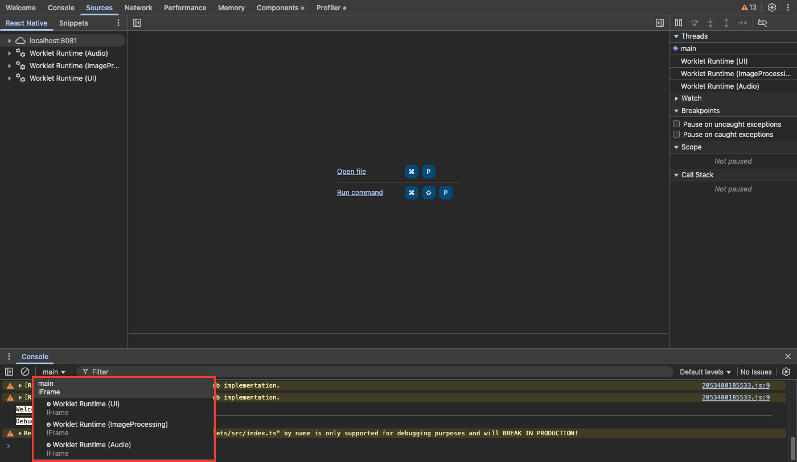

# RFC0000: Secondary JavaScript runtimes in React Native

## Summary

React Native gets a first-party C++ API to create additional Hermes runtimes next to the Main
Runtime of a React Instance. A Secondary Runtime:

1. is created by React Native on request, with a user-provided name and a Hermes configuration;
2. has no event loop and no task queue. React Native creates one lifecycle queue per runtime for its
   own operations on it;
3. is owned by the caller. The React Instance tracks it and invalidates it on teardown, the same way
   it invalidates native modules, but does not keep it alive;
4. is visible in React Native DevTools as a thread of the app's single DevTools target;
5. can evaluate the app's JavaScript bundle, execute the entry points it is configured with, and
   receive module updates and lazy chunks from Metro.

`react-native-worklets` does part of this today with private React Native APIs and patches to Metro.
This RFC moves the shared part into React Native.

## Basic example

Native side, from a native module:

```cpp
// `secondaryRuntimeManager` belongs to the ReactInstance the module was installed into.
std::unique_ptr<SecondaryRuntime> runtime = secondaryRuntimeManager->createSecondaryRuntime(SecondaryRuntimeConfig{
  .name = "Custom",
  .hermesConfig = ::hermes::vm::RuntimeConfig::Builder()
                    .withGCConfig(::hermes::vm::GCConfig::Builder()
                                    .withMaxHeapSize(64 << 20)
                                    .build())
                    .build(),
  .bundleConfig = SecondaryRuntimeBundleConfig{
    .entryPoints = {"custom"},
    .beforeLoad = [](jsi::Runtime& rt) {
      // install the globals the bundle expects
    },
    .onLoad = [](jsi::Runtime& rt, RunEntryPoints runEntryPoints) {
      // the bundle is evaluated and up to date; start the program where it belongs
      myThread.post([runEntryPoints] { runEntryPoints(); });
    },
  },
});

{
  auto lock = runtime->lock();
  runtime->getRuntime().evaluateJavaScript(/* ... */);
}
```

Metro side, `metro.config.js`:

```js
module.exports = {
  serializer: {
    entryPoints: {
      main: './index.js',
      custom: './index.custom.js',
    },
  },
};
```

DevTools: press `j` in Metro and open the single `React Native Bridgeless` target. The runtime
`Custom` appears in the _Threads_ pane of the Sources panel and in the context selector of the
Console panel.

> [!NOTE]
>
> The DevTools part of this proposal was prototyped on React Native 0.87 with an unmodified React
> Native DevTools frontend.
>
> Metro sees one target for the whole app, so `j` opens DevTools without a picker:
>
> 
>
> Every runtime is a thread of that one target:
>
> 
>
> 

## Motivation

Community libraries run additional JavaScript runtimes on other threads to drive animations, handle
gestures, process camera frames or talk to the GPU. React Native, Metro and React Native DevTools
assume one JavaScript runtime per app, so these libraries work around that assumption with fragile
code. The issues:

1. **Debugging.** The modern inspector (`jsinspector-modern`) assumes one runtime per React
   Instance. To debug an secondary runtime, a library must open a second connection to the Metro
   inspector proxy, register as a second "device" with its own page, and implement the CDP `Target`
   domain itself so its runtimes appear in the same DevTools window as the Main Runtime. React
   Native already has this infrastructure.
2. **Main-thread inspector.** On iOS the inspector sends and receives its messages on the main queue
   (`RCTCxxInspectorWebSocketAdapter`, `RCTCxxInspectorPackagerConnectionDelegate`), on Android on
   the main looper (`CxxInspectorPackagerConnection`). A runtime that runs on the main thread cannot
   receive `Debugger.resume` after it pauses on a breakpoint. The app stays frozen.
3. **Module updates.** Some secondary runtimes need third-party modules from the JavaScript bundle.
   React Native exposes the bundle file path and the Metro bundle URL, but no API delivers HMR
   updates or lazily loaded chunks to an secondary runtime. HMR updates also trigger React Fast
   Refresh, which does not apply to an secondary runtime.
4. **Entry points.** Metro appends `__r(...)` calls to the bundle that run unconditionally: one for
   each module in `getModulesRunBeforeMainModule` (React Native's runtime setup,
   `react-native/setup-env`) and one for the app's entry module. A runtime that evaluates the same
   bundle but must start from different code has no supported way to select its entry point.
5. **Lifecycle.** Native modules receive `invalidate` when the React Instance is torn down. Extra
   runtimes run on their own threads, so the owner forwards `invalidate` by hand. This produces
   nested asynchronous callbacks and deadlocks on shutdown.

The problems are the limits of the current API, not missing polish. The workarounds break across
React Native and Metro versions and cannot be published as normal npm packages.

This RFC is an umbrella proposal. It adds APIs to React Native core to create and manage Secondary
Runtimes, and each part is expected to get its own proposal or pull request. A future Web Worker
implementation on Hermes needs the same pieces: a runtime, DevTools visibility, the bundle, an entry
point and module updates.

## Detailed design

### Glossary

- **Host**: the object that owns an app's React Native lifecycle, `ReactHost` on Android and
  `RCTHost` on iOS. It survives reloads and registers the inspector page.
- **React Instance**: `ReactInstance`, the C++ object that owns the Main Runtime and the loaded
  bundle. A reload destroys the instance and creates a new one under the same host.
- **Main Runtime**: the single `jsi::Runtime` the React Instance creates, where React runs. In
  DevTools it is the thread named `main`.
- **Secondary Runtime**: a `jsi::Runtime` created through `SecondaryRuntimeManager`. The owner holds
  it.
- **Owner**: the code that called `createSecondaryRuntime` and holds the returned
  `std::unique_ptr<SecondaryRuntime>`.
- **Lifecycle queue**: a serial queue React Native creates for every Secondary Runtime and uses for
  its own operations on it.
- **Runtime lock**: a recursive mutex owned by every Secondary Runtime. Every access to the runtime,
  by React Native or by the owner, holds it.
- **Bundle**: the script Metro produces for the app. In development it is served from the dev
  server, in release it is embedded in the app as source or as Hermes bytecode.
- **Entry point**: a module Metro starts after the bundle is defined. This RFC makes entry points a
  named set, and each runtime executes only the entry points it is configured with.
- **Chunk**: a part of the bundle fetched on demand in development when the bundle URL has
  `lazy=true`. Release bundles have no chunks.
- **Module update**: a message from Metro's HMR server with the new code of one or more edited
  modules. Applying it re-evaluates the module factories in a runtime.

DevTools terms (CDP is the Chrome DevTools Protocol): a **page** is the unit the inspector registers
with `IInspector::addPage` and that one DevTools window connects to; React Native registers one page
per host. A **target** is a debuggable unit inside a page; the page is the main target and each
Secondary Runtime is a child target of type `worker`, the type browsers use for Web Workers. A
**session** is one CDP connection to a target; a message to a child target carries a `sessionId`.
The **inspector proxy** is the server in `@react-native/dev-middleware`, hosted by Metro, between
the app and DevTools.

### Responsibilities

React Native, through `SecondaryRuntimeManager`, is responsible for:

1. Creating the Hermes runtime and the runtime lock, from any thread, before the Main Runtime is
   initialized.
2. Running its own operations on the lifecycle queue under the runtime lock, and evaluating lazy
   chunks through the owner's `runtimeExecutor`.
3. Registering the runtime in DevTools as a worker target and keeping the inspector off the main
   thread.
4. Evaluating the bundle and calling the runtime lifecycle hooks.
5. Delivering module updates and lazy chunks in development.
6. Invalidating every live runtime on instance teardown and calling `onInvalidate`.
7. Reporting errors thrown by its own lifecycle jobs to `JsErrorHandler`.
8. Assigning each runtime an id that is unique in the process.

The owner is responsible for:

1. Holding the `SecondaryRuntime` object and destroying it when its own code no longer uses the
   runtime.
2. Running its own JavaScript under the runtime lock, and providing its own threads, event loop,
   timers and microtask draining.
3. Installing every global the code in the runtime expects.
4. Deciding what happens after a module update: accept handlers, refresh, restart.
5. Catching and reporting errors in the JavaScript it runs.
6. Stopping its own scheduling and dropping its references in `onInvalidate`.
7. Guaranteeing the safety of anything that involves two runtimes or two threads.
8. Integrating the runtime with native modules, if it needs any. React Native installs none.

### 1. Creation and ownership

This RFC adds `SecondaryRuntimeManager`, a C++ object owned by `ReactInstance`
(`packages/react-native/ReactCommon/react/runtime/ReactInstance.h`) and exposed through
`ReactInstance::getSecondaryRuntimeManager()`. Two internal parts hold state:
`ModuleUpdateDispatcher` ([Module updates from Metro](#5-module-updates-from-metro)) and
`ChunkLoader` ([Lazy chunks](#42-lazy-chunks)). Neither has a public API.

```cpp
// Returned by RuntimeFactory. `hermesRuntime` is the engine inside `runtime`; the
// inspector and the profiler need it because a decorator hides it. It is valid as
// long as `runtime` is.
struct CreatedRuntime {
  std::shared_ptr<jsi::Runtime> runtime;
  hermes::HermesRuntime& hermesRuntime;
};

// Creates the Hermes runtime from the config and returns the jsi::Runtime used from
// then on. The default factory returns Hermes itself. A custom factory returns its
// own jsi::Runtime built around it, for example a jsi::WithRuntimeDecorator that
// takes `runtimeLock` on every call.
using RuntimeFactory = std::function<CreatedRuntime(
    const ::hermes::vm::RuntimeConfig& config,
    std::shared_ptr<std::recursive_mutex> runtimeLock)>;

enum class ModuleUpdateOrdering {
  Relaxed,   // see section 5
  Strict,
};

struct LoadError {
  enum class Step { BeforeLoad, Evaluation, ModuleUpdate };
  Step step;
  std::string message;   // the JavaScript error message when the step threw a jsi::JSError
};

// Runs the configured entry points of one runtime by calling the bundle's `__s`
// (section 4.1). The owner
// calls it once, on the thread of its choice, holding the runtime lock. Throws the
// jsi::JSError of a failing entry point to the caller.
using RunEntryPoints = std::function<void()>;

struct SecondaryRuntimeBundleConfig {
  std::vector<std::string> entryPoints;                 // in execution order; empty: registry only
  int moduleUpdatePriority{1};                          // Main Runtime is 0; see section 5
  ModuleUpdateOrdering moduleUpdateOrdering{ModuleUpdateOrdering::Relaxed};
  std::function<void(jsi::Runtime&)> beforeLoad;        // lifecycle queue, before evaluation
  std::function<void(jsi::Runtime&, RunEntryPoints)> onLoad;   // lifecycle queue, after evaluation
                                                        // and replay; receives the runner
  std::function<void(const LoadError&)> onLoadError;    // when a load step threw; see section 4
  std::optional<RuntimeExecutor> runtimeExecutor;       // where lazy chunks are evaluated;
                                                        // absent: no lazy chunks; section 4.2
};

struct SecondaryRuntimeConfig {
  std::string name;
  std::optional<::hermes::vm::RuntimeConfig> hermesConfig;   // absent: Hermes defaults
  std::optional<RuntimeFactory> runtimeFactory;              // absent: plain Hermes
  std::optional<RuntimeExecutor> lifecycleExecutor;          // replaces the lifecycle queue
  bool debuggable{true};                                     // false: not registered in DevTools
  std::optional<SecondaryRuntimeBundleConfig> bundleConfig;      // absent: no bundle
  std::function<void(jsi::Runtime&)> onInvalidate;           // last job React Native runs
};

class SecondaryRuntime {
 public:
  jsi::Runtime& getRuntime();                        // hold lock() while using it
  std::unique_lock<std::recursive_mutex> lock();
  const std::string& getName() const;                // user-provided
  const std::string& getId() const;                  // name + UUID, unique in the process
  ~SecondaryRuntime();                                   // non-blocking; see "Destruction"

 private:
  friend class SecondaryRuntimeManager;
  void invalidate();
};

class SecondaryRuntimeManager {
 public:
  std::unique_ptr<SecondaryRuntime> createSecondaryRuntime(SecondaryRuntimeConfig config);
  static std::shared_ptr<SecondaryRuntimeManager> fromRuntime(jsi::Runtime& mainRuntime);
};

std::shared_ptr<SecondaryRuntimeManager> ReactInstance::getSecondaryRuntimeManager();
```

Rules:

1. **Engine.** Hermes only, created with `hermes::makeHermesRuntime`. Hermes is the engine React
   Native ships and the only one React Native DevTools supports: the inspector integration
   (`HermesRuntimeTargetDelegate`), the sampling profiler and bytecode bundles are Hermes APIs, and
   this RFC depends on all three. `runtimeFactory` can replace the default creation to decorate the
   runtime; the `hermesRuntime` member of its result is what the inspector and the profiler use.
2. **Runtime lock.** Hermes is not thread-safe, so every access to the runtime holds the runtime
   lock: React Native's lifecycle jobs, inspector jobs and chunk jobs, and the owner's own code
   through `SecondaryRuntime::lock()`.
3. **Lifecycle queue.** One serial queue per runtime on its own thread, or the owner's
   `lifecycleExecutor` in its place. React Native runs bundle evaluation, module updates, inspector
   jobs and invalidation there. The entry points are the runtime's own program: the owner starts
   them where it runs its JavaScript, with the runner it receives in `onLoad`. Lazy chunks run
   through `runtimeExecutor`, under the same executor contract. An owner-provided
   `lifecycleExecutor` must meet the same contract as the queue: it runs jobs in FIFO order, one at
   a time, never on the calling thread, and it runs or destroys every job it accepts. Inspector jobs
   are posted from the inspector thread. An owner that cannot meet the contract sets `debuggable` to
   `false`, which skips the DevTools registration. The queue holds every job until the worker
   registration on the inspector thread completed, the same way `ReactInstance` buffers work until
   its runtime is registered, so the inspector globals (console bridge, session observer) exist
   before any job runs.
4. **Destruction.** The `SecondaryRuntime` object keeps a weak reference to its
   `SecondaryRuntimeManager`. Its destructor hands the runtime to the manager and returns; it never
   blocks. The manager then, in order: unregisters the worker from DevTools on the inspector thread,
   which destroys its agents and makes them enqueue their final runtime tasks on the lifecycle
   queue; posts the close job to the lifecycle queue, which runs behind those tasks, destroys the
   `HermesRuntimeTargetDelegate` under the runtime lock and marks the queue closed; and releases its
   reference to the `jsi::Runtime`, which is destroyed with the last reference. If the manager no
   longer exists, the same sequence runs without the DevTools step.
5. **Invalidation.** On instance teardown the `SecondaryRuntimeManager` invalidates every live
   Secondary Runtime, like native modules, and never waits for anything. Inside
   `ReactInstance::unregisterFromInspector`, before the instance itself is unregistered and on the
   inspector thread, it detaches every worker from DevTools and resumes the ones paused in the
   debugger. Then it posts `onInvalidate` to each lifecycle queue as the last job React Native
   schedules there and returns. When that job runs is up to the executor; React Native does not
   depend on it. `invalidate` is not part of the owner's API; the owner ends a runtime by destroying
   the `SecondaryRuntime` object.

### 2. Access from native modules

A native module never holds the `ReactInstance`, so the `SecondaryRuntimeManager` is reachable in
three ways:

- **C++ modules**: `SecondaryRuntimeManager::fromRuntime(jsi::Runtime&)`, where the argument is the
  Main Runtime the module was created for. `TurboModuleProviderFunctionTypeWithRuntime` already
  receives that runtime, so no provider signature changes. The manager is stored as runtime data of
  the Main Runtime, the same mechanism `HostTarget::attachToRuntime` uses for the inspector.
- **iOS**: a property on `RCTHost` and on the `RCTTurboModule` initialization params, next to the
  call invoker.
- **Android**: a getter on `ReactApplicationContext`, next to `getJSCallInvokerHolder`, backed by a
  Kotlin `SecondaryRuntimeManager` wrapper over the C++ object.

The `SecondaryRuntimeManager` is valid for the lifetime of the instance. After the instance is torn
down, `createSecondaryRuntime` returns null and the manager holds no runtimes.

### 3. DevTools

Every Secondary Runtime is a **worker target** of the instance's inspector page, following the model
browsers use for Web Workers. The Console, Sources, Performance and Memory panels have to work for
it. The Network panel is [future work](#future-work).

All three changes below are required. Without the first the runtimes do not appear. Without the
second a runtime on the main thread cannot be resumed. Without the third the sources and source maps
of worker threads do not load.

#### 3.1 `jsinspector-modern`

Inside the inspector a Secondary Runtime is called a _worker_, to match the CDP naming: the `Target`
domain reports it with `type: "worker"`, and the DevTools frontend treats it as a Web Worker of a
page.

`HostTarget` (`packages/react-native/ReactCommon/jsinspector-modern/HostTarget.h`) gets:

```cpp
struct WorkerDescription {
  std::string title;   // shown as the thread name
  std::string url;     // must differ from title
};

class WorkerTarget;    // owned by HostTarget

WorkerTarget& HostTarget::registerWorker(
    WorkerDescription description,
    RuntimeTargetDelegate& delegate,        // HermesRuntimeTargetDelegate for the Secondary Runtime
    RuntimeExecutor lifecycleExecutor);
void HostTarget::unregisterWorker(WorkerTarget& worker);
```

`registerWorker` creates a `RuntimeTarget` for the runtime, the same class the Main Runtime uses, so
each runtime gets its own console, debugger, profiler and heap tooling. The execution context is
named after the runtime, which is the name the Threads pane and the Console context selector show.

A new `TargetAgent`, owned by each `HostTargetSession`, implements the CDP `Target` domain in front
of `HostAgent`. Sessions are flattened as in
[Chrome](https://chromedevtools.github.io/devtools-protocol/tot/Target/): a message to a child
session carries a `sessionId`, the agent routes it to the worker's `RuntimeAgent`, and replies and
events carry the `sessionId` back. `Target.attachedToTarget`, `Target.detachedFromTarget` and
`Target.targetDestroyed` follow the worker's registration and unregistration.
`ReactNativeApplication.enable` and `.disable` on a child session are answered with an empty result;
that domain is host-level.

Three host-level pieces learn about workers:

- `HostCommand::DebuggerResume`, sent by the "paused in debugger" overlay, gets a target id. The
  overlay names the paused runtime, and the host forwards the resume to the child session of that
  target instead of the main session only.
- The per-session exported runtime state (breakpoints, pause-on-exceptions) is today one slot,
  `SessionState::lastRuntimeAgentExportedState`, written by `~RuntimeAgent` and imported by the next
  `RuntimeTarget::create` after a reload. It becomes a map keyed by target `url`, with the Main
  Runtime under its own key: each `~RuntimeAgent` writes to its target's key and each
  `RuntimeTarget::create` imports from its own. A worker re-created after a reload with the same
  `url` gets its state back, and the Main Runtime never inherits a worker's.
- Tracing (the Performance panel) follows the browser model: one trace, many threads.
  `InstanceTracingAgent::setTracedRuntime`, which holds one `RuntimeTarget`, becomes
  `addTracedRuntime` / `removeTracedRuntime`; the host-level `TracingAgent` starts and stops the
  sampling profiler on every registered `RuntimeTarget`, and `HostTargetTraceRecording` serializes
  each runtime's `RuntimeSamplingProfile` under its own thread id in the one trace, the way Chrome
  records a page and its workers in one `Tracing` session. The frontend already renders such traces.

`createSecondaryRuntime` performs the registration. The owner does not call `HostTarget`.

Breakpoints in a worker's entry code hit in both cases DevTools supports for workers:

- After a reload, the exported state of the previous agent restores them at registration, before the
  lifecycle queue releases its jobs, as for the Main Runtime.
- On first creation, a session that attached with `Target.setAutoAttach`'s `waitForDebuggerOnStart`
  gets `waitingForDebugger: true` in `Target.attachedToTarget`, and the lifecycle queue stays held
  until that session sends `Runtime.runIfWaitingForDebugger` on the child session. DevTools applies
  its stored breakpoints in between. The owner is not involved: `onLoad` and the runner it receives
  come from the held queue, so the program cannot start early.

#### 3.2 Inspector off the main thread

The inspector cannot run on the main thread when a runtime may run there. Per platform:

- **iOS**: a serial `RCTInspectorQueue`. The web socket adapter, the packager connection and the
  `HostTarget` executor use it. Delegate methods that need UIKit (`onReload`,
  `onSetPausedInDebuggerMessage`, `onSetEmulatedMedia`, screenshots) are dispatched asynchronously
  to the main queue.
- **Android**: a `HandlerThread` (`InspectorThread`). `CxxInspectorPackagerConnection` uses its
  `Handler`, `ReactHostInspectorTarget` uses it as the executor, and `ReactHostImpl` reposts
  `setPausedInDebuggerMessage` to the UI thread. `ReactInstance.unregisterFromInspector` runs on the
  inspector thread instead of the UI thread.

Result: a runtime paused on the main thread can be resumed, and pausing a Secondary Runtime does not
block the Main Runtime's session.

#### 3.3 Metro inspector proxy

When the page does not declare `nativeSourceCodeFetching`, which React Native never does, the
inspector proxy answers `Network.loadNetworkResource` and `Debugger.getScriptSource` itself and
rewrites `Debugger.setBreakpointByUrl`. Two changes:

1. The proxy's own replies must echo the CDP `sessionId` of the request. Without it the frontend
   never matches the reply to the worker session, and source maps of worker threads never load.
2. The map from script id to source URL must be keyed per session. Hermes numbers scripts per
   runtime, so every runtime that loaded the bundle reports it as the same script id.

The frontend needs no change.

#### 3.4 Panel requirements

| Feature                                                     | Required behavior                                                                                                                                                        |
| ----------------------------------------------------------- | ------------------------------------------------------------------------------------------------------------------------------------------------------------------------ |
| Breakpoints, `debugger`, step, pause and resume per runtime | independent per runtime                                                                                                                                                  |
| Breakpoint in a module shared by several runtimes           | set in every runtime, pauses the one that executes it (Chrome semantics)                                                                                                 |
| Reload                                                      | reloads the whole app; workers are re-registered in the same session                                                                                                     |
| Performance panel                                           | `HermesRuntime::registerForProfiling` is called on the thread that runs the runtime's JavaScript; every worker's samples appear in the one trace under its own thread id |
| Memory panel                                                | heap snapshots and sampling through the child session's `HeapProfiler` domain                                                                                            |

### 4. Bundle loading and entry points

`bundleConfig`, an optional `SecondaryRuntimeBundleConfig`, holds all bundle settings. When it is
absent, React Native does not evaluate the bundle in the runtime. When it is present, React Native
evaluates the script it loaded into the Main Runtime in the Secondary Runtime as well, on its
lifecycle queue, as soon as the script is available, which can be before the Main Runtime evaluated
it. In development the update buffer is complete only after the Main Runtime's `HMRClient`
registered with Metro; an edit made between the bundle fetch and that registration reaches an
Secondary Runtime as a normal live update, like an edit made during startup. The React Instance
keeps the script for its lifetime for this purpose; today it releases the script after evaluation.
Static Hermes units (`evaluateSHUnit`) have no script, and `createSecondaryRuntime` with
`bundleConfig` returns null on such an instance.

The load runs in this order:

1. `beforeLoad`, the place to install the globals the bundle expects;
2. bundle evaluation, which defines modules and installs [`__s`](#41-entry-points-and-the-__s-tail),
   the function that starts entry points;
3. in development, replay of every module update buffered since the bundle was fetched
   ([Module updates from Metro](#5-module-updates-from-metro));
4. `onLoad`: the bundle is evaluated and up to date and no entry point has run. The hook receives a
   `RunEntryPoints` runner that calls [`__s(entryPoints)`](#41-entry-points-and-the-__s-tail) for
   this runtime. The owner calls it once, on the thread where it runs the runtime's JavaScript and
   holding the runtime lock; a UI runtime, for example, starts its program on the main thread. A
   failing entry point throws its `jsi::JSError` to the caller of the runner. When `onLoad` is
   absent, React Native calls the runner itself at the end of the load job.

All four steps run as one job on the lifecycle queue. If steps 1 to 3 throw, the remaining steps are
skipped and `onLoadError` runs instead of `onLoad` with the step and the error message.

The replay precedes the entry points so that no entry point runs stale code. The instance keeps the
script it fetched at startup. A runtime created after the developer edited files would otherwise
start its entry point from old code and re-run the edited modules when the updates arrive. A `__d`
redefinition of a module that is defined but not initialized only swaps its factory
([`metro-runtime/src/polyfills/require.js`](https://github.com/facebook/metro/blob/main/packages/metro-runtime/src/polyfills/require.js),
`metroHotUpdateModule`), so the replay into a registry that nothing has required executes nothing.

#### 4.1 Entry points and the `__s` tail

Metro gets a new `serializer.entryPoints` option:

```js
serializer: {
  entryPoints: { main: './index.js', custom: './index.custom.js' },
}
```

All entry points are part of the same bundle and the same dependency graph, so shared modules are
deduplicated and HMR sees them once. The bundle no longer calls `__r` at its end. Instead the
serializer emits a global function `__s` (under `__METRO_GLOBAL_PREFIX__` like `__d` and `__r`) that
maps entry point names to module ids and requires the ones it is asked for:

```js
// end of the bundle, emitted by the serializer
global.__s = function (names) {
  const entryPoints = { main: 1, custom: 42 };
  for (const name of names) {
    __r(entryPoints[name]);
  }
};
```

Evaluating the bundle only defines modules and installs `__s`. React Native calls `__s` through JSI:
`__s(["main"])` on the Main Runtime right after evaluation, `__s(entryPoints)` on a Secondary
Runtime after the replay. Metro always emits the `__s` tail; without `serializer.entryPoints` the
table holds `main` only, so an app without the option behaves as today. The modules from
`getModulesRunBeforeMainModule` run as part of `main`. If `__s` is not defined after evaluation,
React Native assumes the bundle started itself: a bundle from an older Metro, an over-the-air bundle
built before this change, or a bundle from another bundler keeps working, and such a bundle cannot
be loaded into a Secondary Runtime.

Tying module definitions to entry points, so that a runtime registers only the modules its entry
points reach, is [future work](#future-work).

#### 4.2 Lazy chunks

In development the bundle URL carries `lazy=true`, so Metro serves only the modules reachable
through static imports and turns every `import()` into a fetch of a chunk: `asyncRequire` in
`metro-runtime` calls `global.__loadBundleAsync`, which React Native installs on the Main Runtime in
`__DEV__` as `loadBundleFromServer`. Each runtime has its own module registry, so a chunk evaluated
in the Main Runtime does nothing for a Secondary Runtime.

The runtime's own code starts a chunk load, so the chunk must be evaluated where the owner runs
JavaScript, the same `runtimeExecutor` that runs the entry points:

1. When `runtimeExecutor` is set, React Native installs `__loadBundleAsync` on the runtime before
   the bundle is evaluated. When it is absent, `asyncRequire` falls back to a synchronous `require`,
   and an `import()` of a module outside the initial bundle fails with a missing-module error, as
   today.
2. `__loadBundleAsync(path)` returns a promise and asks the `ChunkLoader` for the chunk. C++ core
   has no HTTP client, so the fetch goes through a platform delegate; which one is an
   [unresolved question](#unresolved-questions). No `fetch` global is needed on the runtime.
3. Once fetched, React Native posts one job through `runtimeExecutor` that evaluates the chunk with
   the chunk URL as source URL and resolves the promise. Draining the microtask that `asyncRequire`
   chained onto the promise is the owner's responsibility, as for any promise in the runtime.
4. `ChunkLoader` registers the chunk URL with the Main Runtime's `HMRClient`
   (`HMRClient.registerBundle`, a JavaScript call made through the Main Runtime's executor), so
   edits to modules that only a Secondary Runtime imported still produce module updates.
5. Fetched chunks are cached per instance and invalidated by module updates that touch them. A
   runtime gets a chunk only when its own code imports it; chunks are not replayed.

`prefetch` and `unstable_importMaybeSync` from `asyncRequire` work the same way. Release bundles
have no chunks and none of this is compiled in.

### 5. Module updates from Metro

Delivery and re-evaluation of updated modules on every runtime that loaded the bundle. What a
runtime does after re-evaluation is the owner's responsibility. React Native and `metro-runtime` do
not run Fast Refresh on Secondary Runtimes. `metro-runtime` provides a second `__accept`
implementation that swaps the module factory, re-runs it, and calls a global hook instead of React
Refresh; React Native installs it on Secondary Runtimes.

1. Exactly one HMR connection per bundle, owned by the Main Runtime's `HMRClient`. Secondary
   Runtimes never connect to Metro.
2. `metro-runtime`'s `HMRClient` gets a hook that receives each whole update, as one message, before
   the Main Runtime applies it. React Native binds the hook natively. The hook fires where the
   client applies an update, controlled by the Fast Refresh toggle; updates that arrive while Fast
   Refresh is off are merged and delivered when it is turned on, as they are for the Main Runtime
   today. The hook is asynchronous: the client applies the update to the Main Runtime after the hook
   has resolved, defers re-emitting Metro's `update-done` until then, and queues updates that arrive
   while a hook is pending. React Native uses the hook to order the Main Runtime's re-evaluation
   against the Secondary Runtimes, and a second signal after the Main Runtime applied the update, so
   the runtimes sorted after it can proceed.
3. Each runtime declares its own place in the update sequence in its `SecondaryRuntimeBundleConfig`.
   `moduleUpdatePriority` sorts the runtimes: the Main Runtime is fixed at `0`, Secondary Runtimes
   default to `1`, lower values apply first, ties apply in creation order, and a negative value puts
   a runtime before the Main Runtime. `moduleUpdateOrdering` sets whether later runtimes wait for
   this one; the names follow `std::memory_order`. The Main Runtime is `Strict`: Secondary Runtimes
   sorted after it apply an update only after the Main Runtime did.
   - `Relaxed` (default for Secondary Runtimes): `ModuleUpdateDispatcher` dispatches this runtime's
     job and moves on. Only the dispatch order is guaranteed.
   - `Strict`: `ModuleUpdateDispatcher` waits until this runtime finished applying the update before
     it dispatches the next runtime. Later runtimes never have newer code than this one for a shared
     module. The wait happens on the dispatcher's own thread. Cost: a `Strict` runtime that cannot
     finish, paused in the debugger or with an executor that holds the job, stalls every runtime
     sorted after it, including the Main Runtime if it comes later.

4. `ModuleUpdateDispatcher` buffers every update for the lifetime of the instance and replays the
   buffer to a runtime that loads the bundle later, between its bundle evaluation and its entry
   points ([Bundle loading and entry points](#4-bundle-loading-and-entry-points)). Creating a
   runtime and applying an update exclude each other: the dispatcher lock is held while an update is
   appended to the buffer and the list of runtimes it goes to is fixed, and while a new runtime
   snapshots the buffer and joins that list. A runtime that joins after the list was fixed receives
   the update from its snapshot, so no update is applied twice or lost.

## Drawbacks

1. **Implementation cost.** Three packages change: `react-native` (`jsinspector-modern`, the
   inspector transport on both platforms, `ReactInstance`, native module access on both platforms),
   `metro` (serializer) and `metro-runtime` (`HMRClient` hook, `__accept`), plus
   `@react-native/dev-middleware`.
2. **Memory and startup in development.** Every runtime that loads the bundle parses it again, the
   React Instance keeps the script buffer for its lifetime, and buffered module updates keep every
   edited module's code in memory during a development session.
3. **Threads.** One lifecycle thread per Secondary Runtime by default; owners with a thread of their
   own pass `lifecycleExecutor`.
4. **Teaching.** Two names for one thing: "Secondary Runtime" in the API and "worker" in DevTools.
   The name "Worker Runtime" was deliberately avoided to not confuse the developers with Web
   Workers.
5. **Migration.** Changes to Metro code usually have widespread consequences and require immediate
   adoption by library authors.

## Alternatives

1. **Keep it in libraries.** The problems in [Motivation](#motivation) remain, and every library
   ships its own copy of the inspector integration.
2. **One inspector page per Secondary Runtime.** Simpler in `jsinspector-modern`, but every runtime
   becomes a separate entry in `j` and in `chrome://inspect`, with no shared breakpoints, console or
   source maps. Browsers and the DevTools frontend already use the worker-target model.
3. **Per-runtime HMR connections.** Every runtime opens its own socket to Metro. It needs
   `WebSocket` on every runtime and Metro would have to distinguish Secondary Runtimes from the Main
   Runtime. One connection and a native dispatcher put all ordering in `ModuleUpdateDispatcher`.
4. **Distinct source URLs per runtime.** Avoids script id collisions in the proxy but breaks source
   map sharing and the "one breakpoint, every runtime" behavior. Fixing the proxy is the smaller
   change.
5. **`ThreadSafeHermesRuntime` instead of the runtime lock.** `makeThreadSafeHermesRuntime` locks
   every JSI call, but `HermesRuntimeTargetDelegate` and the CDP agents work on the inner
   `HermesRuntime` and bypass that lock, and `registerForProfiling` binds to the calling thread. It
   becomes an option once the inspector takes the same lock; until then the runtime lock owned by
   `SecondaryRuntime` is the only way to serialize React Native's jobs and the owner's code.
6. **Thread and event loop provided by React Native.** Owners that attach runtimes to existing
   threads, or share one queue across runtimes, could not do so. A lifecycle queue that only carries
   React Native's own jobs, with `lifecycleExecutor` as the opt-out, keeps both cases possible.

## Adoption strategy

Every change except the Metro tail stays behind the feature flag `enableSecondaryRuntimes` in
`ReactNativeFeatureFlags` until step 6 lands, and for one minor release after that. The Metro tail
cannot be flagged, because the bundle is produced before the app runs; it lands with the React
Native release that calls `__s`, and Metro and React Native versions move together through
`@react-native/community-cli-plugin`.

1. Implement worker targets in `jsinspector-modern`, move the inspector off the main thread and fix
   the dev-middleware proxy. This step depends on none of the others.
2. Implement `SecondaryRuntimeManager` with `createSecondaryRuntime`, the runtime lock, the
   lifecycle queue and invalidation with `onInvalidate`, and expose the manager to native modules.
3. Implement `SecondaryRuntimeBundleConfig` in React Native and add `serializer.entryPoints` and the
   `__s` tail to Metro.
4. Add the `metro-runtime` hook and `__accept`, and implement `ModuleUpdateDispatcher`.
5. Implement `ChunkLoader` on top of `runtimeExecutor`.
6. Extend the Performance and Memory panels to worker targets.

Each step is big enough to be a sub-RFC of its own, reviewed and landed separately.

### Breaking changes

None for an app that uses React Native and Metro as shipped together. The changes below can break
code that depends on the internals they touch.

1. **Bundle tail.** Every bundle Metro emits for React Native ends with `__s` instead of
   `__r(mainModuleId)`. Anything that evaluates such a bundle itself and expects the app to start
   must call `__s(["main"])`: custom bundle loaders in brownfield apps and test harnesses. A React
   Native older than this change fed a bundle from a newer Metro does not start; the reverse
   direction keeps working because React Native accepts a bundle without `__s`.
2. **Inspector threading.** `HostTargetDelegate` methods, `InspectorPackagerConnection` callbacks
   and `HostTarget` executor jobs run on the inspector thread instead of the main thread. Every
   `HostTargetDelegate` outside `react-native`, that is every out-of-tree platform and custom host,
   must dispatch UI work to the main thread itself.
3. **Inspector proxy.** Replies the proxy generates itself carry the CDP `sessionId`, and script
   sources are keyed per session. Clients that never send a `sessionId` see the old replies.

## How we teach this

- A section "Secondary Runtimes" in the architecture docs: what a runtime is and is not, the runtime
  lock, the lifecycle queue, the ownership contract, `onInvalidate`, and error handling until
  `JsErrorHandler` is runtime-agnostic.
- The DevTools docs get a "Threads" section: every runtime is a thread, pausing a runtime pauses its
  thread, reload is per app.
- The Metro docs document `serializer.entryPoints` and the `__s` tail.

## Unresolved questions

1. The default set of globals on a Secondary Runtime (`console`, `performance`).

## Future work

1. A thread-safe, runtime-agnostic `JsErrorHandler` and RedBox, so React Native reports errors from
   lifecycle jobs itself.
2. Tying module definitions to entry points, so a Secondary Runtime registers only the modules its
   entry points reach.
3. Per-runtime reload.
4. Hermes Web Workers built on this API, including an API for cross-runtime messaging.
5. Parsing the bundle once and instantiating it in several runtimes, once Hermes supports it.
6. Routing network requests from Secondary Runtimes to the DevTools Network panel.
7. Kotlin and Objective-C wrappers of `SecondaryRuntime` for owners written in those languages.
